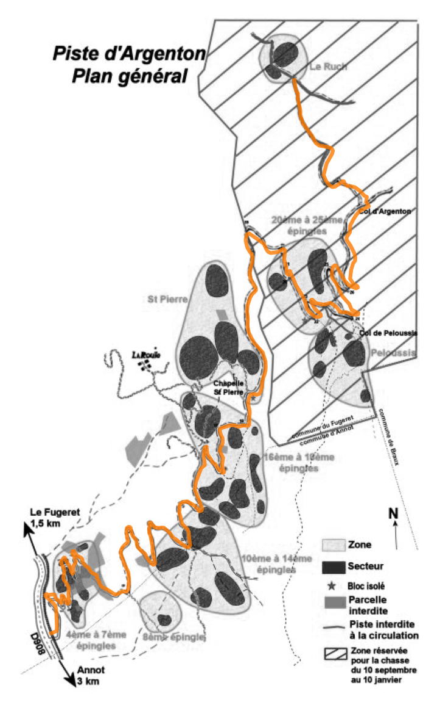

# annot-boulder-geodata
Retrieve geodata from [ABloc.org](http://abloc.org) and integrate it into [OpenStreetMap](https://www.openstreetmap.org) database

- Primary goal: Add the 37 boulder sites as nodes or areas with their names
- Secondary goal: Add additional tags such as grades https://wiki.openstreetmap.org/wiki/Climbing

## To do:
- [x] download sites map images
- [x] get POI from OSM and map images
- [x] get accurate pixel indices to geographic coordinates transform
- [ ] detect boulder site blobs (in green)
  - [x] quantize image colors (sites in green, roads in black, etc.)
  - [ ] get masks
  - [ ] separate blobs
- [ ] registrer sub images (e.g. "zone de la 4ème à la 7ème épingle") to general map

- [ ] name bouder sites
- [ ] add to OSM

OSM track over map image:

## Licence
From [ABloc.org](http://ablog.org)

> Droits d'auteur: toute reproduction du topo est vivement encouragée par quelque moyen que ce soit (papier ou numérique) à l'exclusion d'une quelconque activité commerciale.

> *Copyrights: any reproduction of the topo is strongly encouraged by any means whatsoever (paper or digital) to the exclusion of any commercial activity.*
